  

  &nbsp;
  &nbsp;
  &nbsp;
  &nbsp;
  

---

## Architecture & Focus

<table>
  <tr>
    <td width="50%" valign="top">
      <h4>📡 Low-Level &amp; Embedded Systems</h4>
      <ul>
        <li>Firmware development targeting ESP32, Arduino, and embedded Linux boards.</li>
        <li>Hardware interfacing and communication bus protocols in C, C++, and Go.</li>
        <li>Sensors, custom peripherals, and IoT telemetry bridges.</li>
      </ul>
    </td>
    <td width="50%" valign="top">
      <h4>📱 Android &amp; Cross-Platform Native</h4>
      <ul>
        <li>Native Android engineering with Kotlin, Jetpack Compose, and Material 3.</li>
        <li>Per-application packet firewalls and local DNS sinkholes (<code>Anis</code>).</li>
        <li>Cross-platform manga reader client with React Native &amp; Expo (<code>paperand</code>).</li>
      </ul>
    </td>
  </tr>
  <tr>
    <td width="50%" valign="top">
      <h4>⚡ Local-First AI &amp; Media Tooling</h4>
      <ul>
        <li>Model Context Protocol (MCP) servers for autonomous tool integration.</li>
        <li>Computer vision, inpainting, and typesetting studios (<code>manga-trans</code>).</li>
        <li>Digital art diagnostics and stylus pressure telemetry (<code>timeflytracking</code>).</li>
      </ul>
    </td>
    <td width="50%" valign="top">
      <h4>🗄️ Relational &amp; Document Storage</h4>
      <ul>
        <li>Enterprise relational database schemas with Microsoft SQL Server (T-SQL).</li>
        <li>High-throughput local SQLite databases for Android Room and offline tools.</li>
        <li>Document-oriented persistence with MongoDB.</li>
      </ul>
    </td>
  </tr>
</table>

---

## Selected Work

| Project | Stack | Overview |
| :--- | :--- | :--- |
| **[manga-trans](https://github.com/chiraitori/manga-trans)** | `Python` `MCP` `FastAPI` `Svelte` | Local-first Model Context Protocol (MCP) server &amp; Web Studio for comic scanlation, inpainting, and typesetting. |
| **[paperand](https://github.com/chiraitori/paperand)** | `TypeScript` `React Native` `Expo` | Ad-free manga reader application for Android &amp; iOS based on the Paperback 0.8 extension framework. |
| **[Mizuki](https://github.com/chiraitori/Mizuki)** | `Kotlin` `Jetpack Compose` `M3` | High-performance, fluid video and audio downloader for Android. |
| **[Anis](https://github.com/chiraitori/Anis)** | `Kotlin` `Jetpack Compose` `M3` | Local DNS sinkhole and per-application packet firewall for Android. |
| **[timeflytracking](https://github.com/chiraitori/timeflytracking)** | `C#` `.NET 8` `WinUI 3` | Native Windows 11 digital art focus tracker, stylus pressure diagnostics, and hardware telemetry. |
| **[phatnguoicheck-go](https://github.com/chiraitori/phatnguoicheck-go)** | `Go` `REST API` | Go microservice for checking Vietnam traffic violation fines via csgt.vn. |
| **[HoYo_Code_Sender_Discord_Bot](https://github.com/chiraitori/HoYo_Code_Sender_Discord_Bot)** | `JavaScript` `Node.js` | Automated redemption code dispatcher and bot service for HoYoverse titles. |

---

## Stack & Toolchain

### Systems & Languages

### Native, Web & Embedded

### Databases & Infrastructure

---

## Telemetry & Activity

<picture>
  <source media="(prefers-color-scheme: dark)" srcset="https://raw.githubusercontent.com/chiraitori/chiraitori/output/github-contribution-grid-snake-dark.svg">
  <source media="(prefers-color-scheme: light)" srcset="https://raw.githubusercontent.com/chiraitori/chiraitori/output/github-contribution-grid-snake.svg">
  
</picture>

 

  
  

  

---

## Development Metrics

<!--START_SECTION:waka-->
<!--END_SECTION:waka-->

---

  

